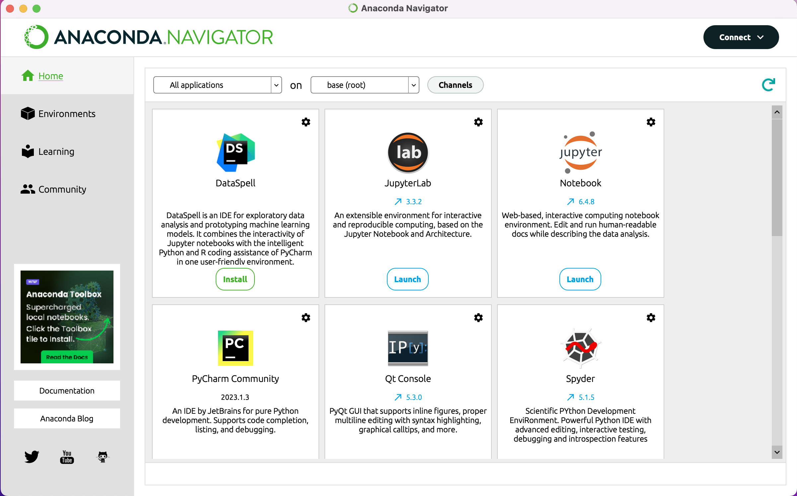
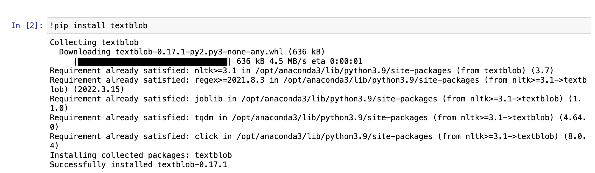

:::::::::::::::::::::::::::::::::::::: questions 

- How do you get started coding with the Python programming language?
- What are the basic principles of coding and using modules in Python?
- What is a Jupyter Notebook and how can we use it to study coding and test our code?
- How can we use the Python module Textblob to perform some basic text analysis?

::::::::::::::::::::::::::::::::::::::::::::::::

::::::::::::::::::::::::::::::::::::: objectives

- Understand what Python is, and the difference between coding and programming.
- Preview the objectives of the entire course
- Learn to install Anaconda 
- Understand what Jupyter Notebooks are
- Learn to install a Python module within Jupyter notebooks

::::::::::::::::::::::::::::::::::::::::::::::::

## Introduction: What is Python?

This course will teach you the fundamental principles of coding and with doing automated analysis of textual data in the programming language Python. It will provide you with a solid foundation of knowledge about working with programming languages, data, and modules that you can carry away to apply to your own projects. It is not intended as an exhaustive course on the Python language itself, but instead is a preparatory course which will provide you with the tools you need to begin the process of learning how to code.

This course teaches coding principles using the Python programming language, which is a very popular general purpose programming language. It is the language most commonly used in the Digital Humanities, and powerful modules (a set of functions which perform specific tasks) for advanced analysis of textual data (including modules for NLP, or Natural Language Processing). It is different from another programming language popular in both the Digital Humanities and the Sciences, R, which is a language that was primarily developed for statistics and producing graphical visualisations of data. It is common for people working in Digital Humanities to work with both languages.

::::::::::::::::::::::::::::::::::::::::::::::::

## What is the difference between coding and programming?

In this course we will be focusing on learning some basic coding skills. Coding is a part of programming, and it involves writing commands that a computer can understand and execute. The primary difference between coding and programming is that programming involves writing full computer programs (it is a part of software development) which use code as their building blocks to solve a problem or perform a complex set of actions. One cannot become a programmer without learning how to write code. 

When you write a line of code, you are writing instructions in a form which the computer can understand and execute.

::::::::::::::::::::::::::::::::::::::::::::::::

## This Course's Objectives

Given the short length of this course, the aim is to learn the fundamentals which will carry you furthest in your goal to learn how to code. We will cover the following areas in today's lesson:

- How to access and work with Python on your machine through Jupyter Notebooks
- How to install a Python module
- How to prepare textual data for automated analysis
- How to interpret the documentation and code within a Python module and tailor it to your own needs.
- How to write simple commands using the language of a Python module in order to analyse a text.
- How to export the results of a Python script into another file format

:::::::::::::::::::::::::::::::::::::::::::::::: spoiler

## How to Install Python using Anaconda Navigator

Anaconda is a software distribution which includes the Python programming language and a large amount of modules and applications within a single installation. Today we will be installing Python using Anaconda, and then using the Navigator (an application installed by Anaconda) to access some of these features. 

Anaconda can be installed easily by following the tutorials below (specific to each operating system):

- [Windows](https://docs.anaconda.com/free/anaconda/install/windows/)
- [Mac](https://docs.anaconda.com/free/anaconda/install/mac-os/)
- [Linux](https://docs.anaconda.com/free/anaconda/install/linux/)

::::::::::::::::::::::::::::::::::::::::::::::::::

## How to Access Jupyter Notebooks

When you open the Anaconda Navigator application you will be able to see a selection of applications from which to choose, one of which is Jupyter Notebooks. Click 'Launch'. {alt="A screenshot of the Anaconda Navigator page with options for different applications"} A webpage will open with a list of the files you have in your local folder. To the right you will see a dropdown button, 'New'. You then can click on 'Python 3 (ipykernel)' to open a new Jupyter Notebook. {alt="Image showing the home page of Jupyter Notebooks with the dropdown box for opening a new notebook"}

This will create a new, empty Jupyter Notebook. This notebook is made up of cells in which you can write, try out, and execute code. These notebooks are highly versatile and are the ideal environment for learning how to write code, as you can run the command and see the outputs right within the notebook. You can explore the different options and possible actions in the menu on the left. {alt="image showing what an empty Jupyter Notebook page looks like"} 
We will be writing all of our code in this Jupyter Notebook. Be sure to save it (it will remain on your local hard drive) so that you can access and work with this code later.

::::::::::::::::::::::::::::::::::::::::::::::::::

## Installing a Python Module

A 'module' in Python is a collection of functions that a software developer has put together in code, for a specific purpose. It is akin to a 'library' of instructions that a computer uses to perform certain actions. However, Python calls such libraries 'modules', not 'packages' or 'libraries'.

In this course we will be using the module Textblob. While Anaconda comes with around 250 Python modules pre-installed, Textblob is not one of them. To see if a module is already installed, you can run the 'import' command in a cell: {alt="image of a Jupyter Notebook cell that shows that the package textblob is not installed"}

In this case, we will want to install the module. We run the following command within the cell: {alt="figure showing what the command and output for installing a Python module should look like"}

For those curious: the ! in the command tells Jupyter Notebooks that this is an action to be performed on your actual machine. 'pip' is Python's package manager. Put together, they tell your computer to install the package that you tell it to install right after.

Once a package is installed, you need to import it to be able to use it in a Notebook. From the module 'textblob' we will import the object 'TextBlob': {alt="image showing the command for importing an already installed Python module"}

If successful, **nothing** will appear except a new cell in your notebook. 
